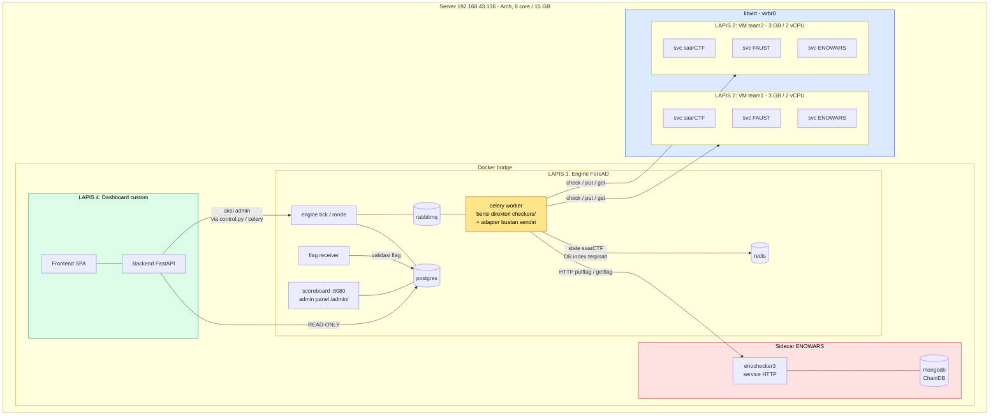
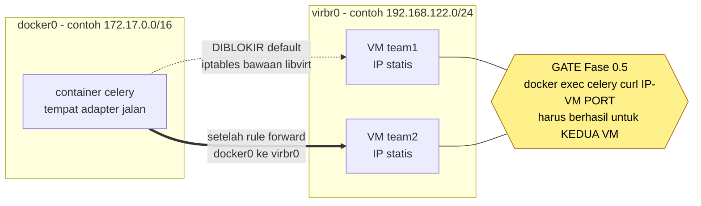
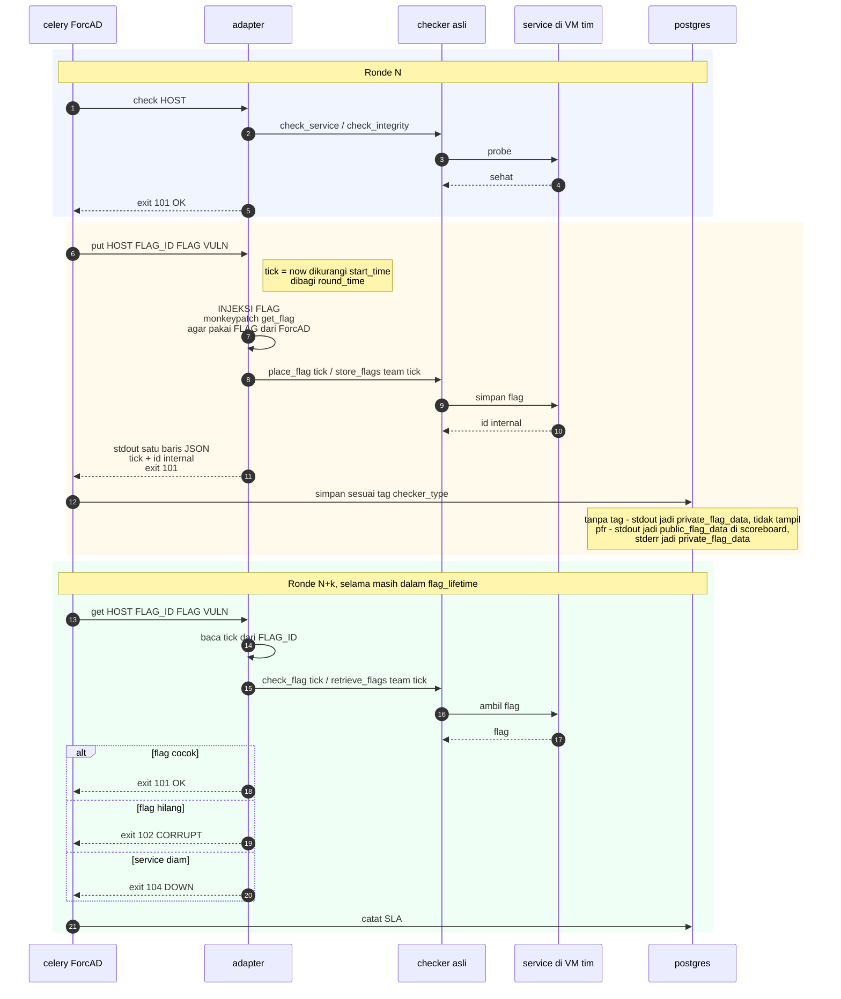
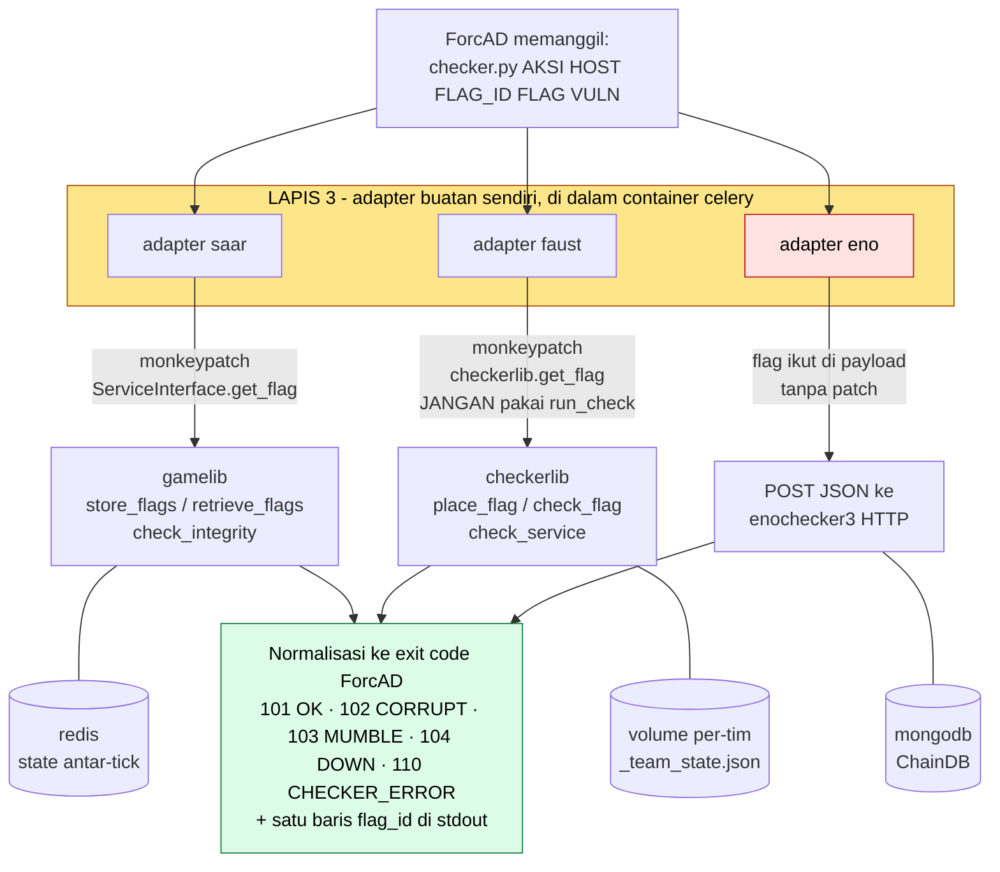
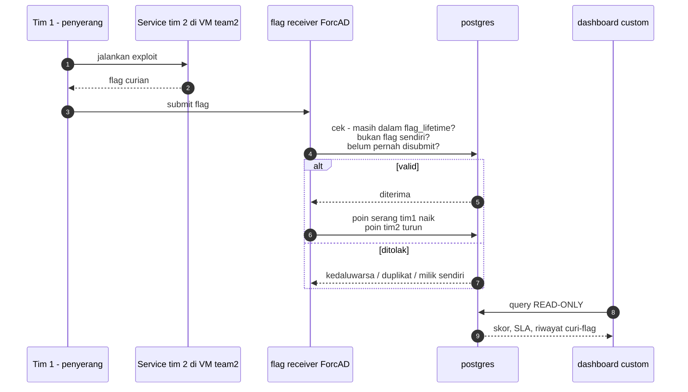
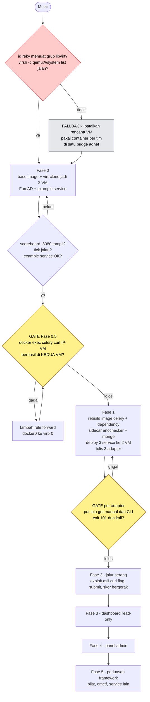

# Skema Platform A/D Internal

Skema visual pendamping [`plan.md`](plan.md). Lima diagram: arsitektur, jaringan, alur satu tick,
anatomi adapter, dan alur serang. Semua pakai Mermaid (render langsung di GitHub/VS Code).

---

## 1. Arsitektur keseluruhan

Empat lapis di satu host. Yang perlu diperhatikan: **checker tidak jalan sendiri** — dia hidup di
dalam container celery, dan dari sanalah semua panggilan keluar.

**LAPIS 3 (adapter)** tidak punya kotak sendiri di gambar — dia hidup *di dalam* `celery worker`
(kotak kuning). Itulah satu-satunya kode glue yang kita tulis untuk unifikasi.

---

## 2. Jaringan: dua bridge yang harus disambung

Ini titik rawan yang paling gampang bikin buntu berjam-jam.

IP kedua VM inilah yang masuk ke `teams[].ip` di `config.yml`. Selama gate ini belum lolos,
**jangan tulis satu baris adapter pun** — semua checker akan balik `DOWN 104` dan kamu akan
men-debug adapter untuk masalah yang sebenarnya ada di iptables.

---

## 3. Alur satu tick: dari mana `flag_id` berasal

Diagram paling penting. Yang dibawa ke GET selalu `private_flag_data` — **kanal mana yang mengisinya
ditentukan tag `checker_type`**: tanpa tag berarti stdout (privat, default kita), `pfr` berarti stdout
tampil publik dan stderr yang jadi state privat.

**Konsekuensi desain** — default ForcAD sudah privat, jadi state PUT→GET aman ditulis apa adanya di
stdout. Tag `pfr` dipakai hanya kalau service memang harus mempublikasikan flag id ke penyerang
(meniru perilaku asli saarCTF/ENOWARS); saat itu state privat pindah ke stderr.

---

## 4. Anatomi lapis adapter

Satu bentuk panggilan ForcAD, tiga cara berbeda menerjemahkannya. Perbedaan terpenting: **siapa
yang membuat flag**.

Pemetaan status per framework:

| Kondisi | saarCTF | FAUST | ENOWARS | → ForcAD |
|---|---|---|---|---|
| sehat | tanpa exception | `CheckResult.OK` | `OK` | **101** |
| flag hilang | `FlagMissingException` | `FLAG_NOT_FOUND` | flag tidak cocok | **102** |
| perilaku salah | `MumbleException` | `FAULTY` / `RECOVERING` | `MUMBLE` | **103** |
| tak terhubung | `OfflineException` | `DOWN` | `OFFLINE` | **104** |
| bug checker | exception lain | exception | `INTERNAL_ERROR` | **110** |

---

## 5. Alur serang & skor

Sisi bertahan berjalan paralel: kalau service tim 2 mati atau salah di-patch, checker dari
[diagram 3](#3-alur-satu-tick-dari-mana-flag_id-berasal) mengembalikan 103/104 dan **SLA tim 2 turun**
— jadi menambal dengan cara mematikan service tetap merugikan.

---

## 6. Urutan fase & gate

Tiap panah bercabang adalah titik di mana kamu berhenti dan memverifikasi sebelum lanjut.

